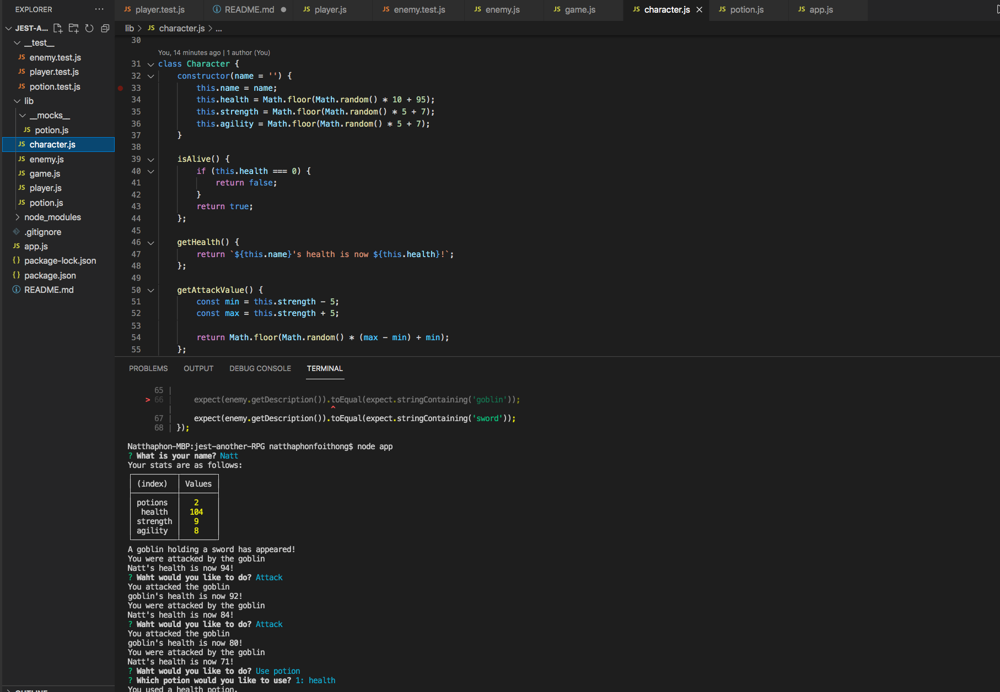

# Jest Another RGP

## Description
Build an entire application using object-oriented programming (OOP), separating data and functionality into different constructor functions. Use modern ES6 class syntax to implement inheritance between classes. Verify that your code works as intended through automated tests using the Jest framework.

## Table of Contents

- [Installation](#installation)
- [Usage](#usage)
- [Learn](#learn)
- [Fraustration](#fraustration)

## Installation
Open terminal and install: 
- node
- npm init
- npm i inquirer
- npm --save-dev jest

## Usage

## Learn 
Using OOP to build a game RGP application and practice TDD (test-driven development) with jest - javascript testing framework to test before writing code.

## Fraustration
New things / codes to learn to build game application also refactoring code by using ES6